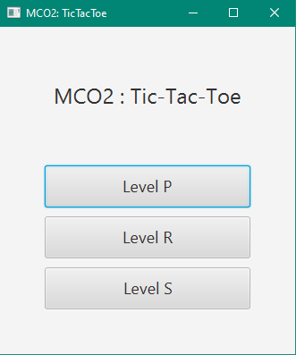
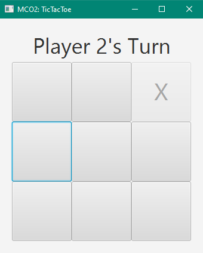
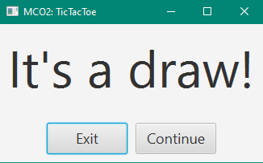

# TicTacToe
In this project, we were tasked to create 2 levels of Tic Tac Toe. Level R for the **random** move chosen by the AI and Level S for the **smart** move chosen by the AI. As an additional, I added Level P, where in a player can play against another player.

### Screenshots
#### 1. Menu

#### 2. Game

#### 3. End Game

 